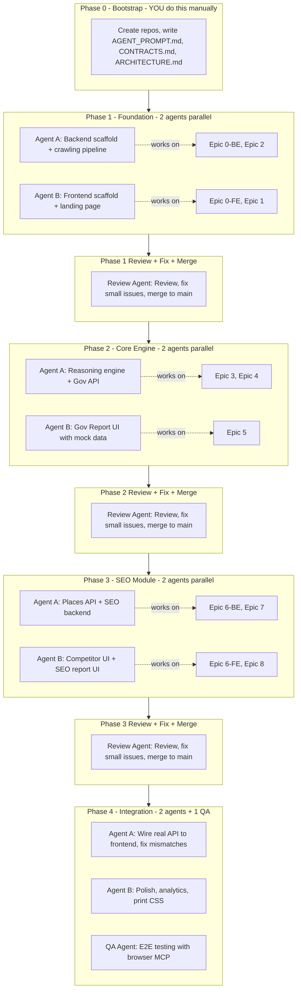

# Engineering Plan: Website Governance OS + Local Competitive SEO Report

> **Living document.** Zone 1 (sections above the separator) reflects current state and is updated per change.
> Zone 2 (below the separator) is the original V1 build plan, preserved as historical record.
> Version history is tracked in the table below; full content at any point is available via `git show <sha>:ENGINEERING_PLAN.md`.

## Version History

| Version | Date | Change ID | Summary |
|---------|------|-----------|---------|
| 1.0.0 | 2026-02-07 | V1 | All phases complete. 23 user stories, 335 tests (215 BE + 120 FE) |
| 1.1.0 | 2026-02-07 | CHG-001 | Pipeline limits increase (timeout 90s to 180s, max pages 8 to 20) + pages_analyzed CTA. Contract 1.0.0 to 1.1.0 |
| 1.2.0 | 2026-02-07 | CHG-003 | Pipeline timeout increased to 450s (redo of reverted CHG-002) |
| 1.3.0 | 2026-02-07 | CHG-004 | Fix ProgressBar percentage display (0.0-1.0 scale, not 0-100) |
| 1.4.0 | 2026-02-07 | CHG-005 | Two-view report: Business Overview (default) + Technical Details tabs. Contract 1.1.0 to 1.2.0. 38 new tests |
| 1.5.0 | 2026-02-07 | CHG-006 | Business-goal-aware executive narrative. New business_goals.py module. 25 new tests |
| 1.6.0 | 2026-02-07 | CHG-007 | Move CompetitorForm from Technical tab to SEO tab |
| 1.7.0 | 2026-02-07 | CHG-008 | Suggest competitors via Google Places API. New endpoint GET /api/report/suggest-competitors. Contract 1.2.0 to 1.3.0 |
| 1.8.0 | 2026-02-07 | CHG-009 | Demo mode (DEMO_MODE env var) for instant report generation |
| 1.9.0 | 2026-02-07 | CHG-010 | Fix golden fixture narrative drift + drift guard test |
| 1.10.0 | 2026-02-07 | CHG-011 | Improve competitor suggestion relevance (two-step search) + Google review card. Contract 1.3.0 to 1.4.0 |
| 1.11.0 | 2026-02-08 | CHG-012 | Click competitor suggestion card to fill URL input |
| 1.12.0 | 2026-02-08 | CHG-013 | SEO pipeline reuses governance results via governance_job_id. Contract 1.4.0 to 1.5.0 |
| 1.13.0 | 2026-02-09 | CHG-014 | Phase 1 Foundation Signals. 5 new detector/analyzer modules + 15 new GovernanceReport fields. Contract 1.5.0 to 1.6.0. 54 new tests |
| 1.14.0 | 2026-02-09 | CHG-015 | Phase 1 Pipeline Integration (completes CHG-014). 5 reasoning templates + issue builder integration + pipeline wiring. 9 new tests |
| 1.15.0 | 2026-02-09 | CHG-016 | Business-first confidence filtering for Foundation Signals. Frontend-only. 4 tests updated |
| 1.16.0 | 2026-02-09 | CHG-017 | Playwright CDP fallback for PSI API failures. New cdp_perf_client.py + psi_client.py fallback. 21 new tests |
| 1.17.0 | 2026-02-09 | CHG-018 | Segment-aware personalized business overview. SegmentProfile classifier + Gemini-generated PersonalizedContent + CategoryInsight model. Contract 1.6.0→1.7.0. 49 new tests |
| 1.18.0 | 2026-02-09 | CHG-019 | Fix zip() length mismatch in page/soup collection. Lockstep build for pages[] and soups[]. 1 new test |
| 1.19.0 | 2026-02-10 | CHG-020 | Honest 5+5 bulleted lists in Business Overview. PersonalizedContent gains whats_working/needs_attention. Gemini prompt with page context + honest tone rules. 12 new tests |
| 1.20.0 | 2026-02-10 | CHG-021 | Pipeline timeout increased 450→750s. Config-only change |
| 1.21.0 | 2026-02-10 | CHG-022 | Concurrent page fetching via asyncio.gather + semaphore. max_concurrent_page_fetches config (default 5). Soup collection ~300s→~60s. 6 new tests |
| 1.22.0 | 2026-02-10 | CHG-023 | Pipeline performance optimization: robots.txt cache, parallel sampler with soups, batch Gemini issue_insights. Contract 1.7.0→1.8.0. 16 new tests (13 backend + 3 frontend) |
| 1.23.0 | 2026-02-10 | CHG-024 | SOLID compliance checks added to DoD enforcement (check_dod.sh, test_layering.py, DEFINITION_OF_DONE.md, Review Agent template). Permissive thresholds. No production code changes |
| 1.24.0 | 2026-02-10 | CHG-025 | Split schemas.py (34 classes) into 6 domain modules (enums, requests, governance, seo, responses, transparency). Barrel re-export. 14 new tests |
| 1.25.0 | 2026-02-10 | CHG-026 | Detector protocol + registry. 8 detectors self-register via @register_detector. engine.py iterates DETECTOR_REGISTRY. 8 new tests |
| 1.26.0 | 2026-02-10 | CHG-027 | Extract report-building from pipeline.py → reasoning/report_builder.py + services/error_classifier.py. pipeline.py 1256→686 lines. 18 new tests |
| 1.27.0 | 2026-02-10 | CHG-028 | Extract 9 pipeline steps into PipelineStep classes. pipeline.py 686→247 lines. New pipeline_context.py + pipeline_steps.py. 10 new tests |
| 1.28.0 | 2026-02-10 | CHG-029 | Crawler callable protocols for DIP. Steps accept injected deps. GOVERNANCE_STEPS → build_governance_steps() factory. H-SOLID-4 enforcement. 18 new tests |
| 1.29.0 | 2026-02-10 | CHG-030 | Split gemini_summarizer.py 875→308 lines. 3 new modules + SummarizerProtocol. 12 new tests |

## Current Statistics

> Auto-verify with: `./scripts/plan_stats.sh`

| Metric | Count |
|--------|-------|
| Backend tests | 555 |
| Frontend tests | 173 |
| **Total tests** | **728** |
| API endpoints | 6 |
| Frontend components | 22 |
| V1 user stories | 23 |
| Post-V1 changes | 30 (CHG-001 through CHG-030) |
| Contract version | 1.8.0 |

## Architecture Overview

```mermaid
graph TB
    subgraph frontend [Frontend - React/Vite/TS]
        LandingPage --> InputForm
        InputForm -->|"POST /api/report/governance"| APIClient
        APIClient -->|"Poll GET /api/report/status/{job_id}"| ReportPage
        ReportPage --> BusinessTab
        ReportPage --> TechnicalTab
        ReportPage --> SEOTab
        CompetitorForm -->|"POST /api/report/seo"| APIClient
        CompetitorForm -->|"Click suggestion"| FillURL["Fill URL Input (CHG-012)"]
        ReportPage -->|"useCompetitorSuggestions"| APIClient
    end

    subgraph backend [Backend - FastAPI/Python]
        APIRouter --> JobManager
        JobManager --> CrawlPipeline
        CrawlPipeline --> URLNormalizer
        CrawlPipeline --> HTMLFetcher
        CrawlPipeline --> SitemapParser
        CrawlPipeline --> PageSampler
        CrawlPipeline -->|"asyncio.gather (CHG-022)"| ConcurrentFetch["Concurrent Soup Fetch"]
        HTMLFetcher --> BeautifulSoup
        HTMLFetcher --> PlaywrightFallback
        CrawlPipeline --> DetectorEngine
        DetectorEngine --> StackDetector
        DetectorEngine --> A11yDetector
        DetectorEngine --> SecurityDetector
        DetectorEngine --> IntegrationDetector
        DetectorEngine --> FoundationSignals["Foundation Signals (CHG-014)"]
        FoundationSignals --> SiteAgeDetector
        FoundationSignals --> PartnerDetector
        FoundationSignals --> ComplexityDetector
        FoundationSignals --> InventoryAnalyzer
        FoundationSignals --> TechnicalDebtScorer
        CrawlPipeline --> PSIClient
        PSIClient -->|"CDP fallback (CHG-017)"| CDPPerfClient
        CrawlPipeline --> ReasoningEngine
        ReasoningEngine --> TemplateLibrary
        ReasoningEngine --> BusinessGoals["BusinessGoals (CHG-006)"]
        ReasoningEngine --> SegmentClassifier["SegmentClassifier (CHG-018)"]
        ReasoningEngine --> GeminiSummarizer["GeminiSummarizer (CHG-018/020)"]
        ReasoningEngine --> ReportBuilder
        APIRouter --> SuggestCompetitors["SuggestEndpoint (CHG-008)"]
        SuggestCompetitors -->|"Two-step search (CHG-011)"| PlacesClient
        APIRouter --> DemoMode["DemoFixture (CHG-009)"]
    end

    subgraph external [External APIs]
        PSIClient -->|HTTPS| GooglePSI
        CDPPerfClient -->|"Headless Chromium"| LocalBrowser
        PlacesClient -->|HTTPS| GooglePlaces
        GeminiSummarizer -->|HTTPS| GeminiAPI
    end
```



## API Endpoints

| Method | Path | Description | Added |
|--------|------|-------------|-------|
| GET | `/api/health` | Health check | V1 |
| POST | `/api/report/governance` | Start governance report generation | V1 |
| GET | `/api/report/status/{job_id}` | Poll job status + retrieve report | V1 |
| POST | `/api/report/seo` | Start SEO competitive report generation | V1 |
| POST | `/api/report/full` | Combined governance + SEO report | V1 |
| GET | `/api/report/suggest-competitors` | Suggest competitors via Google Places (two-step search) | CHG-008 |

## Tech Stack Summary

| Layer         | Choice                                                |
| ------------- | ----------------------------------------------------- |
| Frontend      | React 19 + Vite 7 + TypeScript 5.9                    |
| Styling       | Tailwind CSS v4                                       |
| FE Testing    | Vitest + React Testing Library                        |
| Backend       | Python 3.12 + FastAPI + uvicorn                       |
| BE Testing    | pytest + httpx (async)                                |
| Crawling      | BeautifulSoup/lxml (primary) + Playwright (fallback)  |
| External APIs | Google PSI API, Google Places API, Gemini 2.5 Pro     |
| Deployment    | Railway (FE + BE as separate services)                |
| Repos         | 2 git submodules under `/frontend` and `/backend`     |

## Polling-Based Job Flow

```mermaid
sequenceDiagram
    participant Client
    participant API as FastAPI
    participant JobStore as InMemoryJobStore
    participant Pipeline

    Client->>API: POST /api/report/governance
    API->>JobStore: Create job (status: queued)
    API->>Pipeline: Start background task
    API-->>Client: { job_id, status: queued }

    loop Every 2-3 seconds
        Client->>API: GET /api/report/status/{job_id}
        API->>JobStore: Get job state
        API-->>Client: { status, progress, current_step, steps_completed }
    end

    Pipeline->>JobStore: Update progress per step
    Pipeline->>JobStore: Set status: complete + report data

    Client->>API: GET /api/report/status/{job_id}
    API-->>Client: { status: complete, report: {...} }
end
```

---
---

# Zone 2: Historical V1 Build Plan

> Everything below this line is the **original V1 build plan** and is preserved as a historical record.
> It is NOT updated with post-V1 changes. For current state, see the sections above.

---

## Epic 0: Project Scaffolding & Infrastructure

### US-0.1: Backend project setup

**As a** developer, **I want** a FastAPI project with proper structure, **so that** I can build features on a solid foundation.

**Acceptance Criteria:**

- `/backend` directory with: `app/`, `app/api/`, `app/core/`, `app/services/`, `app/models/`, `app/detectors/`, `app/templates/`, `tests/`
- `pyproject.toml` with dependencies: fastapi, uvicorn, httpx, beautifulsoup4, lxml, playwright, google-generativeai, pydantic, mypy, ruff
- `requirements.txt` generated from pyproject
- CORS middleware configured (allow frontend origin)
- `GET /api/health` returning `{ status: "ok" }`
- pytest configured with async support, conftest.py with test client
- `.env.example` with all required env vars

**Test Cases:**

- `test_health_endpoint_returns_200` — GET /api/health returns 200 + correct JSON
- `test_cors_headers_present` — response includes CORS headers for allowed origin
- `test_env_vars_loaded` — settings model loads from env or raises clear error

### US-0.2: Frontend project setup

**As a** developer, **I want** a Vite + React + TS project with Tailwind + shadcn, **so that** I can build the UI.

**Acceptance Criteria:**

- `/frontend` directory with Vite + React 18 + TypeScript
- Tailwind CSS configured + shadcn/ui initialized
- Directory structure: `src/components/`, `src/pages/`, `src/lib/`, `src/hooks/`, `src/types/`, `src/services/`
- API client service with base URL config
- Vitest + RTL configured with a passing smoke test
- ESLint + Prettier configured

**Test Cases:**

- `App.test.tsx` — renders without crashing
- `api-client.test.ts` — API client constructs correct URLs

### US-0.3: Git repos & branching setup

**As a** developer, **I want** separate git repos with feature-branch workflow, **so that** PRs can be reviewed per story.

**Acceptance Criteria:**

- `git init` in both `/frontend` and `/backend`
- `.gitignore` for each (Python + Node respectively)
- Branch naming convention: `epic-X/us-X.Y/short-description`

---

## Epic 1: Landing Page & Input Form

### US-1.1: Landing page layout and hero

**As a** visitor, **I want** to see a clear, professional landing page, **so that** I understand what the tool does and trust it.

**Acceptance Criteria:**

- Hero section with headline, subheadline, and CTA pointing to form
- Responsive layout (mobile-first)
- Trust indicators section (e.g., "No login required", "Results in under 90 seconds", "100% transparent")
- Clean typography and spacing using shadcn defaults

**Test Cases:**

- `landing-page.test.tsx` — renders hero heading, subheading, CTA button
- `landing-page.test.tsx` — CTA button scrolls to or navigates to form
- `landing-page.test.tsx` — responsive: all elements visible at 375px width

### US-1.2: Input form with validation

**As a** user, **I want** to enter my website, location, business type, and intent, **so that** I can generate a governance report.

**Acceptance Criteria:**

- Fields: Website URL (required), City (required), State/Region (required), Country (required), Business Type (required dropdown), Intent (required radio/select)
- Business types: Clinic, Dental, Healthcare Services, NGO, Education, Construction, Logistics, Manufacturing, Professional Services, Other
- Intent options: "I care about search traffic / SEO", "I care about stability / governance", "Both"
- Client-side validation: URL format check, all required fields, min length
- Submit button: "Generate Governance Report"
- Loading state on submit
- Error display for invalid inputs

**Test Cases:**

- `input-form.test.tsx` — renders all required fields
- `input-form.test.tsx` — submit disabled when required fields empty
- `input-form.test.tsx` — shows validation errors for invalid URL (e.g., "not-a-url")
- `input-form.test.tsx` — shows validation errors when required fields are missing
- `input-form.test.tsx` — calls onSubmit with correct payload when valid
- `input-form.test.tsx` — submit button shows loading state during submission
- `input-form.test.tsx` — business type dropdown contains all 10 options
- `input-form.test.tsx` — intent selector contains all 3 options

### US-1.3: Form submission and navigation

**As a** user, **I want** the form to submit and navigate me to the report page, **so that** I can see my report being generated.

**Acceptance Criteria:**

- POST to `/api/report/governance` with form data
- On success (job_id received), navigate to `/report?job={job_id}`
- On API error, show user-friendly error message
- Network error handling with retry option

**Test Cases:**

- `form-submission.test.tsx` — sends correct POST payload to API
- `form-submission.test.tsx` — navigates to /report?job=xxx on success
- `form-submission.test.tsx` — displays error message on 4xx/5xx
- `form-submission.test.tsx` — displays network error with retry button

---

## Epic 2: Backend Core — Website Crawling & Analysis Pipeline

### US-2.1: URL normalization and safety checks

**As the** system, **I want** to normalize and validate input URLs, **so that** the pipeline processes clean, safe targets.

**Acceptance Criteria:**

- Add scheme if missing (default https://)
- Strip trailing slashes, fragments, tracking params
- Reject private IPs, localhost, non-HTTP schemes
- Reject URLs on a blocklist (e.g., google.com, facebook.com)
- Return normalized URL + domain

**Test Cases:**

- `test_url_normalizer.py::test_adds_https_scheme` — "example.com" -> "[https://example.com](https://example.com)"
- `test_url_normalizer.py::test_strips_trailing_slash` — "[https://example.com/](https://example.com/)" -> "[https://example.com](https://example.com)"
- `test_url_normalizer.py::test_strips_fragments` — removes #section
- `test_url_normalizer.py::test_strips_tracking_params` — removes utm_* params
- `test_url_normalizer.py::test_rejects_private_ip` — raises for 192.168.x.x, 10.x.x.x, 127.0.0.1
- `test_url_normalizer.py::test_rejects_localhost` — raises for localhost URLs
- `test_url_normalizer.py::test_rejects_non_http` — raises for ftp://, file://
- `test_url_normalizer.py::test_rejects_blocklisted` — raises for google.com, facebook.com
- `test_url_normalizer.py::test_extracts_domain` — returns correct domain

### US-2.2: HTML fetcher (hybrid strategy)

**As the** system, **I want** to fetch and parse HTML using BeautifulSoup with Playwright fallback, **so that** I can analyze both static and JS-rendered sites.

**Acceptance Criteria:**

- Primary: httpx GET + BeautifulSoup parse
- Detect JS-heavy pages (minimal HTML body, framework markers like `<div id="root"></div>` only)
- Fallback: Playwright headless fetch for JS-heavy pages
- Per-fetch timeout: 15 seconds
- Return: raw HTML, parsed soup, fetch method used, status code, response headers
- Respect robots.txt (best-effort: fetch robots.txt first, check rules)

**Test Cases:**

- `test_html_fetcher.py::test_fetches_static_html` — returns parsed HTML for static site (mock httpx)
- `test_html_fetcher.py::test_detects_js_heavy_page` — triggers Playwright for empty body
- `test_html_fetcher.py::test_respects_timeout` — raises TimeoutError after 15s
- `test_html_fetcher.py::test_returns_metadata` — response includes method, status_code, headers
- `test_html_fetcher.py::test_respects_robots_txt` — skips disallowed paths
- `test_html_fetcher.py::test_handles_connection_error` — returns error result, not exception
- `test_html_fetcher.py::test_handles_ssl_error` — handles SSL cert issues gracefully

### US-2.3: Sitemap parser

**As the** system, **I want** to find and parse sitemaps, **so that** I can discover the site's page structure.

**Acceptance Criteria:**

- Check `/sitemap.xml`, `/sitemap_index.xml`, and robots.txt `Sitemap:` directive
- Parse XML sitemap and sitemap indexes
- Extract: URLs, lastmod, changefreq, priority
- Cap at 500 URLs parsed (for performance)
- Return: sitemap_found (bool), url_count, urls list, sitemap_type

**Test Cases:**

- `test_sitemap_parser.py::test_parses_standard_sitemap` — parses valid sitemap.xml
- `test_sitemap_parser.py::test_parses_sitemap_index` — follows and parses index
- `test_sitemap_parser.py::test_finds_sitemap_from_robots` — reads robots.txt Sitemap directive
- `test_sitemap_parser.py::test_handles_missing_sitemap` — returns sitemap_found=False
- `test_sitemap_parser.py::test_caps_at_500_urls` — stops parsing after 500
- `test_sitemap_parser.py::test_handles_malformed_xml` — graceful error

### US-2.4: Page sampler

**As the** system, **I want** to sample 5-8 representative pages, **so that** I can check cross-page consistency.

**Acceptance Criteria:**

- Select pages from sitemap (or crawl links from homepage if no sitemap)
- Sampling strategy: homepage + 1 from each category/section + random fill to 8
- Fetch each with US-2.2 fetcher
- Return: list of page analysis objects (title, meta, headers, word count, schema, links)

**Test Cases:**

- `test_page_sampler.py::test_samples_from_sitemap` — selects diverse URLs
- `test_page_sampler.py::test_falls_back_to_crawl` — uses homepage links when no sitemap
- `test_page_sampler.py::test_caps_at_8_pages` — never fetches more than 8
- `test_page_sampler.py::test_includes_homepage` — homepage always in sample
- `test_page_sampler.py::test_handles_fetch_failures` — continues with remaining pages

### US-2.5: Detector engine — stack, integrations, a11y, security

**As the** system, **I want** to detect technology stack, integrations, accessibility issues, and security posture, **so that** I can generate deterministic findings.

**Acceptance Criteria:**

- **Stack detector**: CMS (WordPress, Wix, Squarespace, etc.), frameworks (React, Next.js, etc.), server headers
- **Integration detector**: analytics (GA, GTM), chat widgets, payment processors, CDNs, marketing tools
- **A11y detector**: missing alt text, missing lang attribute, heading hierarchy, color contrast heuristics, form labels
- **Security detector**: HTTPS status, HSTS header, CSP header, X-Frame-Options, CMS/plugin version exposure
- Each finding is a deterministic signal object: `{ signal_id, category, value, evidence, confidence }`

**Test Cases (per detector, ~20 tests total):**

- `test_stack_detector.py::test_detects_wordpress` — identifies WP from meta generator tag
- `test_stack_detector.py::test_detects_react` — identifies React from bundle markers
- `test_integration_detector.py::test_detects_google_analytics` — finds GA script
- `test_integration_detector.py::test_detects_gtm` — finds GTM container
- `test_a11y_detector.py::test_detects_missing_alt` — flags images without alt
- `test_a11y_detector.py::test_detects_missing_lang` — flags missing html lang
- `test_a11y_detector.py::test_detects_heading_hierarchy` — flags skipped heading levels
- `test_security_detector.py::test_detects_missing_https` — flags HTTP-only
- `test_security_detector.py::test_detects_missing_hsts` — flags no HSTS header
- `test_security_detector.py::test_detects_exposed_versions` — flags visible CMS versions

### US-2.6: PageSpeed Insights API integration

**As the** system, **I want** to fetch PSI data for mobile and desktop, **so that** I have accurate performance metrics.

**Acceptance Criteria:**

- Call PSI API for mobile + desktop strategies
- Extract: performance score, FCP, LCP, TBT, CLS, SI
- Handle API errors gracefully (return partial data or null)
- Cache results per URL within the same job
- API key loaded from env var

**Test Cases:**

- `test_psi_client.py::test_fetches_mobile_scores` — returns mobile metrics (mock API)
- `test_psi_client.py::test_fetches_desktop_scores` — returns desktop metrics
- `test_psi_client.py::test_handles_api_error` — returns None on 4xx/5xx
- `test_psi_client.py::test_handles_timeout` — returns None on timeout
- `test_psi_client.py::test_caches_within_job` — doesn't call API twice for same URL

---

## Epic 3: Deterministic Reasoning Engine

### US-3.1: Reasoning templates library

**As the** system, **I want** a library of deterministic templates, **so that** every finding has consistent, evidence-based explanations.

**Acceptance Criteria:**

- Template structure: `{ trigger_condition, seo_framing: { why, consequence, what_to_do, verification }, governance_framing: { why, consequence, what_to_do, verification } }`
- Minimum 25 templates covering: sitemap missing, robots issues, slow performance, missing meta tags, no HTTPS, missing alt text, no structured data, exposed CMS versions, missing HSTS, no analytics, duplicate titles, thin content, missing H1, multiple H1s, no mobile viewport, slow LCP, high CLS, no canonical, broken internal links, missing Open Graph, no favicon, mixed content, large images, no compression, redirect chains
- Templates stored as Python dataclass objects in a registry
- Lookup by signal_id

**Test Cases:**

- `test_templates.py::test_all_templates_have_both_framings` — every template has SEO + governance
- `test_templates.py::test_template_lookup_by_signal` — registry returns correct template
- `test_templates.py::test_unknown_signal_returns_generic` — fallback template exists
- `test_templates.py::test_template_strings_are_not_empty` — no empty why/consequence/action

### US-3.2: Issue builder and severity scoring

**As the** system, **I want** to convert signals into prioritized issues, **so that** the report is actionable.

**Acceptance Criteria:**

- Convert each signal + template into an Issue object: `{ issue_id, title, severity, confidence, detected_as, evidence[], why_it_matters, what_happens_if_ignored, what_to_do, expected_impact }`
- Severity scoring based on signal type + quantitative thresholds (e.g., PSI < 30 = High)
- Confidence scoring: Observed (directly detected) vs Inferred (heuristic)
- Sort issues by severity (High first), then confidence
- Apply framing based on intent (SEO / Governance / Both)

**Test Cases:**

- `test_issue_builder.py::test_builds_issue_from_signal` — creates correct Issue object
- `test_issue_builder.py::test_severity_high_for_critical` — missing HTTPS = High
- `test_issue_builder.py::test_severity_low_for_minor` — missing favicon = Low
- `test_issue_builder.py::test_confidence_observed` — direct detection = Observed
- `test_issue_builder.py::test_confidence_inferred` — heuristic = Inferred
- `test_issue_builder.py::test_sorts_by_severity_then_confidence`
- `test_issue_builder.py::test_seo_framing_applied` — intent=seo uses SEO template strings
- `test_issue_builder.py::test_governance_framing_applied` — intent=governance uses governance strings
- `test_issue_builder.py::test_both_framing_merges` — intent=both includes both perspectives

### US-3.3: Checklist generator

**As the** system, **I want** to generate a 30-day checklist from issues, **so that** users have a clear action plan.

**Acceptance Criteria:**

- SEO checklist: technical hygiene, content actions, reputation actions
- Governance checklist: monitoring, security patches, backups, a11y, performance
- Each item: `{ action, frequency, owner, effort, why_it_matters }`
- Effort levels: S (< 1 hour), M (1-4 hours), L (4+ hours)
- Owner types: business, developer, agency
- Items derived from detected issues + standard best practices

**Test Cases:**

- `test_checklist.py::test_seo_checklist_categories` — has all 3 SEO categories
- `test_checklist.py::test_governance_checklist_categories` — has all 5 governance categories
- `test_checklist.py::test_each_item_has_required_fields` — no missing fields
- `test_checklist.py::test_effort_values_valid` — only S/M/L
- `test_checklist.py::test_owner_values_valid` — only business/developer/agency
- `test_checklist.py::test_issues_drive_checklist` — critical issue = checklist item

### US-3.4: Gemini 2.5 Pro summarizer

**As the** system, **I want** to use Gemini to rephrase deterministic findings in plain English, **so that** reports are more readable.

**Acceptance Criteria:**

- Gemini rephrases templates, but CANNOT introduce new claims
- System prompt constrains output: "Rephrase the following finding in plain English. Do not add claims, statistics, or recommendations not present in the input."
- Input: deterministic template output (why, consequence, action)
- Output: plain English version
- Fallback: if Gemini fails, use raw template text (no blocking)
- API key from env var

**Test Cases:**

- `test_gemini_summarizer.py::test_rephrases_template` — output differs from input but conveys same meaning (mock API)
- `test_gemini_summarizer.py::test_fallback_on_api_error` — returns raw template on failure
- `test_gemini_summarizer.py::test_fallback_on_timeout` — returns raw template on timeout
- `test_gemini_summarizer.py::test_system_prompt_constrains` — verify system prompt content

---

## Epic 4: Governance Report API

### US-4.1: Job manager and progress tracking

**As the** system, **I want** an in-memory job store with progress updates, **so that** the frontend can poll for status.

**Acceptance Criteria:**

- In-memory dict store (keyed by job_id UUID)
- Job states: queued, processing, complete, failed
- Progress: 0.0 - 1.0 float
- Steps: url_normalize, fetch_homepage, parse_sitemap, sample_pages, run_detectors, run_psi, build_report
- Concurrent job limit per IP (e.g., 3)
- Job expiry after 30 minutes (background cleanup)

**Test Cases:**

- `test_job_manager.py::test_create_job` — returns UUID, initial state queued
- `test_job_manager.py::test_update_progress` — progress updates correctly
- `test_job_manager.py::test_get_status` — returns current state + progress
- `test_job_manager.py::test_complete_job` — state transitions to complete with report data
- `test_job_manager.py::test_fail_job` — state transitions to failed with error
- `test_job_manager.py::test_job_expiry` — expired jobs are cleaned up
- `test_job_manager.py::test_concurrent_limit` — rejects when IP has too many active jobs

### US-4.2: POST /api/report/governance endpoint

**As a** frontend client, **I want** to submit a governance report request, **so that** I receive a job_id to poll.

**Acceptance Criteria:**

- Accepts: `{ website_url, location: { city, region, country }, business_type, intent }`
- Validates all required fields (Pydantic)
- Creates job, starts background pipeline task
- Returns: `{ job_id, status: "queued" }`
- Rate limiting: max 10 requests per IP per hour

**Test Cases:**

- `test_governance_api.py::test_valid_request_returns_job_id` — 202 + job_id
- `test_governance_api.py::test_missing_url_returns_422` — validation error
- `test_governance_api.py::test_missing_location_returns_422`
- `test_governance_api.py::test_invalid_business_type_returns_422`
- `test_governance_api.py::test_invalid_intent_returns_422`
- `test_governance_api.py::test_rate_limit_exceeded_returns_429`

### US-4.3: GET /api/report/status/{job_id} endpoint

**As a** frontend client, **I want** to poll job status, **so that** I can show progress and load the report.

**Acceptance Criteria:**

- Returns current job state, progress, current_step, steps_completed
- When complete: includes full report JSON in response
- When failed: includes error message
- Unknown job_id returns 404

**Test Cases:**

- `test_status_api.py::test_returns_progress` — returns correct progress mid-job
- `test_status_api.py::test_returns_complete_with_report` — includes report JSON when done
- `test_status_api.py::test_returns_failed_with_error` — includes error on failure
- `test_status_api.py::test_unknown_job_returns_404`

### US-4.4: Pipeline orchestrator

**As the** system, **I want** the pipeline to run all analysis steps in order, **so that** a complete governance report is produced.

**Acceptance Criteria:**

- Orchestrates: normalize -> fetch homepage -> parse sitemap -> sample pages -> run detectors -> run PSI -> build issues -> generate checklist -> build report
- Updates job progress after each step
- 90-second overall timeout
- Graceful degradation: if PSI fails, continue without it; if Playwright fails, use static HTML
- Final output matches governance_report schema from PRD Section 7

**Test Cases:**

- `test_pipeline.py::test_full_pipeline_produces_report` — end-to-end with mocked externals
- `test_pipeline.py::test_pipeline_updates_progress` — progress updates at each step
- `test_pipeline.py::test_pipeline_timeout` — fails gracefully at 90s
- `test_pipeline.py::test_pipeline_degradation_no_psi` — report generated without PSI
- `test_pipeline.py::test_pipeline_degradation_no_sitemap` — report generated without sitemap
- `test_pipeline.py::test_output_schema_valid` — output matches Pydantic model

---

## Epic 5: Governance Report UI

### US-5.1: Report page layout and polling

**As a** user, **I want** to see my report loading with progress, **so that** I know the system is working.

**Acceptance Criteria:**

- Route: `/report?job={job_id}`
- Poll `/api/report/status/{job_id}` every 2-3 seconds
- Show progress bar with step labels
- On complete: render report
- On error: show error with "Try again" button
- Header: website URL + location + intent badge

**Test Cases:**

- `report-page.test.tsx` — shows progress bar while polling
- `report-page.test.tsx` — displays step labels as they complete
- `report-page.test.tsx` — renders report on completion
- `report-page.test.tsx` — shows error state with retry button
- `report-page.test.tsx` — displays correct header info

### US-5.2: Executive summary section

**As a** user, **I want** to see a clear summary, **so that** I immediately understand my site's situation.

**Acceptance Criteria:**

- "What's working" — 3+ positive findings (green)
- "What needs attention" — 3-5 priority risks (orange/red)
- Each item has "Observed" vs "Inferred" badge
- Confidence chip (High/Med/Low) per item
- Clean card layout

**Test Cases:**

- `executive-summary.test.tsx` — renders at least 3 positives
- `executive-summary.test.tsx` — renders 3-5 risks
- `executive-summary.test.tsx` — shows Observed/Inferred badges
- `executive-summary.test.tsx` — shows confidence chips

### US-5.3: Metrics cards

**As a** user, **I want** to see key metrics as cards, **so that** I can quickly scan my site's health.

**Acceptance Criteria:**

- Cards: Performance, Accessibility Risk, Maintainability, Security Posture, Integration Posture, Reliability Posture
- Each card: value/band, short meaning, evidence link, "Why it matters" (framed by intent)
- No overall grade/score
- Expandable "Show evidence" section per card

**Test Cases:**

- `metrics-cards.test.tsx` — renders all 6 metric cards
- `metrics-cards.test.tsx` — each card shows value and meaning
- `metrics-cards.test.tsx` — evidence section expands on click
- `metrics-cards.test.tsx` — framing matches intent (SEO vs governance)

### US-5.4: Issues list with expandable evidence

**As a** user, **I want** to see prioritized issues with evidence, **so that** I trust the findings and know what to do.

**Acceptance Criteria:**

- Sorted by severity (High/Med/Low with color coding)
- Each issue expandable to show: evidence[], why_it_matters, what_happens_if_ignored, what_to_do, expected_impact
- Severity + confidence badges
- "Observed" vs "Inferred" label
- Filterable by severity

**Test Cases:**

- `issues-list.test.tsx` — renders issues sorted by severity
- `issues-list.test.tsx` — expands to show full issue details
- `issues-list.test.tsx` — shows correct badges
- `issues-list.test.tsx` — filter by severity works

### US-5.5: 30-day checklist section

**As a** user, **I want** a checklist, **so that** I have clear next steps.

**Acceptance Criteria:**

- Grouped by category (SEO or governance categories based on intent)
- Each item: action, frequency, owner, effort badge, why
- Interactive checkboxes (client-side only, not persisted)

**Test Cases:**

- `checklist.test.tsx` — renders grouped items
- `checklist.test.tsx` — each item shows all fields
- `checklist.test.tsx` — checkboxes toggle

### US-5.6: "What we can't control" section

**As a** user, **I want** transparency about limitations, **so that** I have realistic expectations.

**Acceptance Criteria:**

- Always visible (not collapsible)
- Lists: algorithm shifts, competitor actions, operations capacity, seasonality, service quality, brand/offline word of mouth
- "What we can detect quickly" sub-section

**Test Cases:**

- `limitations.test.tsx` — renders all limitation items
- `limitations.test.tsx` — always visible (not hidden by default)

### US-5.7: Sticky side panel and CTAs

**As a** user, **I want** a summary panel with actions, **so that** I can quickly act on findings.

**Acceptance Criteria:**

- Right-side sticky panel (desktop) / bottom bar (mobile)
- "Top 5 actions" summary
- "Print" button (triggers window.print, print-friendly CSS)
- "Need help?" CTA button
- "Connect GA/GSC" placeholder CTA (disabled, "Coming soon")
- "Compare against competitors" CTA (navigates to competitor input)

**Test Cases:**

- `side-panel.test.tsx` — renders top 5 actions
- `side-panel.test.tsx` — print button triggers print
- `side-panel.test.tsx` — CTA buttons render and are clickable
- `side-panel.test.tsx` — competitor CTA navigates correctly

---

## Epic 6: Competitor Input & Places API Integration

### US-6.1: Google Places API client

**As the** system, **I want** to search nearby competitors and fetch review data, **so that** I can suggest competitors and compare reviews.

**Acceptance Criteria:**

- Nearby search by business type + location -> list of competitors with name, address, place_id, rating, review_count
- Place details fetch for review data (rating, review_count, reviews sample)
- API key from env var
- Rate limiting and error handling
- Fallback: return empty results on API failure

**Test Cases:**

- `test_places_client.py::test_nearby_search` — returns competitor list (mock API)
- `test_places_client.py::test_place_details` — returns rating + review count
- `test_places_client.py::test_handles_api_error` — returns empty on failure
- `test_places_client.py::test_handles_no_results` — returns empty list

### US-6.2: Competitor input form UI

**As a** user, **I want** to input or confirm competitors, **so that** I can generate a competitive SEO report.

**Acceptance Criteria:**

- Shows after governance report loads (as CTA or tab)
- System-suggested competitors from Places API (user can accept/reject)
- Manual input: 3 fields (competitor 1 required, 2 required, 3 optional)
- URL validation per field
- Submit: "Generate Local Competitive SEO Report"

**Test Cases:**

- `competitor-form.test.tsx` — renders 3 competitor URL fields
- `competitor-form.test.tsx` — displays suggested competitors from API
- `competitor-form.test.tsx` — validates URLs
- `competitor-form.test.tsx` — requires at least 2 competitors
- `competitor-form.test.tsx` — submits correct payload

---

## Epic 7: SEO Report Backend

### US-7.1: Competitor analysis pipeline

**As the** system, **I want** to run lite governance + SEO analysis on competitors, **so that** I can compare them.

**Acceptance Criteria:**

- For each competitor: homepage fetch, basic detection, PSI fetch
- Extract: speed band, content signals (page count, service pages, blog), local signals (location pages, schema, NAP), review posture (from Places API)
- Timeout: 15s per competitor, 60s total for competitor analysis phase

**Test Cases:**

- `test_competitor_analysis.py::test_analyzes_competitor` — produces analysis object
- `test_competitor_analysis.py::test_handles_unreachable_competitor` — graceful failure
- `test_competitor_analysis.py::test_respects_timeout` — doesn't exceed time limit
- `test_competitor_analysis.py::test_extracts_all_signals`

### US-7.2: Gap analysis engine

**As the** system, **I want** to compare user vs competitors, **so that** I can identify gaps and strengths.

**Acceptance Criteria:**

- Compare across: reviews, content coverage, local page structure, technical performance, trust signals
- Produce: competitor_advantages (min 3), user_strengths (min 2), gap_breakdown per category
- Each gap includes: what signal, your value, competitor value, significance

**Test Cases:**

- `test_gap_analysis.py::test_identifies_review_gap` — detects review count difference
- `test_gap_analysis.py::test_identifies_content_gap` — detects missing service pages
- `test_gap_analysis.py::test_identifies_strengths` — finds at least 2 user strengths
- `test_gap_analysis.py::test_min_3_competitor_advantages`
- `test_gap_analysis.py::test_min_2_user_strengths`

### US-7.3: 30-day SEO action plan generator

**As the** system, **I want** to generate a week-by-week action plan, **so that** users have a clear SEO roadmap.

**Acceptance Criteria:**

- Week 1: technical foundations + NAP
- Week 2: high-intent pages
- Week 3: reviews + linking + FAQ/schema
- Week 4: measure + adjust
- Each action: why, signal_strengthened, estimated_impact (with caveats), verification_method

**Test Cases:**

- `test_action_plan.py::test_generates_4_weeks` — plan has 4 weeks
- `test_action_plan.py::test_week1_has_technical_actions`
- `test_action_plan.py::test_each_action_has_required_fields`
- `test_action_plan.py::test_actions_include_caveats`
- `test_action_plan.py::test_actions_include_verification`

### US-7.4: POST /api/report/seo endpoint

**As a** frontend client, **I want** to submit an SEO report request, **so that** I can generate the competitive report.

**Acceptance Criteria:**

- Accepts: governance inputs + competitors[]
- Validates: 2-3 competitor URLs required
- Creates job, runs competitor analysis pipeline
- Returns job_id for polling (same polling mechanism as governance)

**Test Cases:**

- `test_seo_api.py::test_valid_request_returns_job_id`
- `test_seo_api.py::test_requires_min_2_competitors`
- `test_seo_api.py::test_rejects_more_than_3_competitors`
- `test_seo_api.py::test_validates_competitor_urls`

---

## Epic 8: SEO Report UI

### US-8.1: Competitor overview table

**As a** user, **I want** to see a comparison table, **so that** I can see how I stack up against competitors.

**Acceptance Criteria:**

- Rows: You + Competitors
- Columns: site speed, content coverage, service breadth, local signals, review posture
- Tooltips on each cell with evidence
- Color coding: green (advantage), red (disadvantage), yellow (neutral)

**Test Cases:**

- `competitor-table.test.tsx` — renders correct rows and columns
- `competitor-table.test.tsx` — shows tooltips on hover
- `competitor-table.test.tsx` — applies correct color coding

### US-8.2: Strengths, weaknesses & gap breakdown

**As a** user, **I want** to see what competitors do better and what I do better, **so that** I can prioritize.

**Acceptance Criteria:**

- "What they're doing better" — min 3 items
- "What you're doing better" — min 2 items
- Gap breakdown by category with visual comparison

**Test Cases:**

- `strengths-gaps.test.tsx` — renders min 3 competitor advantages
- `strengths-gaps.test.tsx` — renders min 2 user strengths
- `strengths-gaps.test.tsx` — renders gap breakdown categories

### US-8.3: 30-day action plan UI

**As a** user, **I want** to see a week-by-week plan, **so that** I know exactly what to do.

**Acceptance Criteria:**

- Collapsible week sections (Week 1-4)
- Each action shows: why, signal, impact estimate, verification
- All impact estimates include caveats
- "We do not guarantee rankings" banner at top

**Test Cases:**

- `action-plan.test.tsx` — renders 4 week sections
- `action-plan.test.tsx` — actions show all required fields
- `action-plan.test.tsx` — disclaimer banner is visible

### US-8.4: Tab navigation between reports

**As a** user, **I want** to switch between Governance and SEO reports, **so that** I can review both.

**Acceptance Criteria:**

- Tabs: "Governance Report" and "Competitive SEO Report"
- SEO tab locked/disabled until competitors are provided and report is generated
- Smooth transition between tabs
- URL doesn't change (same page, client-side tabs)

**Test Cases:**

- `report-tabs.test.tsx` — renders both tabs
- `report-tabs.test.tsx` — SEO tab disabled when no SEO report
- `report-tabs.test.tsx` — SEO tab enabled after report loads
- `report-tabs.test.tsx` — tab switching works

---

## Epic 9: Polish, Analytics & Hardening ✅ COMPLETE

### US-9.1: Analytics instrumentation ✅ COMPLETE

**As the** product owner, **I want** to track success metrics, **so that** I can measure tool effectiveness.

**Acceptance Criteria:**

- Track: report generation start, completion, failure
- Track: time-to-report
- Track: CTA clicks (Need help, Generate SEO, Print/Save)
- Track: tab switches, evidence expansions
- Implementation: simple event logging to console/API (extensible to GA later)

### US-9.2: Error handling & edge cases ✅ COMPLETE

**As a** user, **I want** graceful error handling, **so that** I never see a broken page.

**Acceptance Criteria:**

- 404 page
- API error boundary (frontend)
- Blocked site handling (site blocks crawling entirely)
- Empty/parked domain handling
- Extremely slow sites (show partial results with warnings)

### US-9.3: Print-friendly styling ✅ COMPLETE

**As a** user, **I want** to print the report, **so that** I can share a physical copy.

**Acceptance Criteria:**

- `@media print` styles: hide navigation, side panel CTAs, expand all evidence
- Clean page breaks between sections
- Headers/footers with URL and date

---

## Agent Swarm Strategy (Inspired by Anthropic's Parallel Claude Architecture)

Reference: [Building a C compiler with a team of parallel Claudes](https://www.anthropic.com/engineering/building-c-compiler)

### Key Lessons Applied from Anthropic's Approach

The Anthropic blog demonstrates a system where 16 Claude agents worked in parallel to build a 100K-line C compiler autonomously. The key principles we adapt:

1. **Tests as the oracle** -- Agents orient themselves by running tests, not by asking humans. Our TDD-first approach means every agent knows if it's on track by simply running `pytest` or `vitest`.
2. **Task-lock files prevent collision** -- Agents claim work via files so two agents never solve the same problem. We use a `CURRENT_TASKS.md` file in each repo.
3. **Progress/status files for orientation** -- Each agent session starts fresh with no context. README, PROGRESS.md, and ARCHITECTURE.md files let any agent orient itself in seconds.
4. **Specialized agent roles** -- Beyond dev agents, dedicated agents for code quality, documentation, and performance -- just as Anthropic used separate agents for deduplication, performance, and Rust style critique.
5. **Context window hygiene** -- Test output must be concise. Logs go to files, summaries go to stdout. Never pollute context with thousands of lines.

### Documents Required Before Starting the Swarm

The following files must exist in each repo BEFORE any dev agent starts. These are the "orientation documents" that let a fresh agent session understand the project in under 30 seconds:

#### Backend Repo (`/backend/`)

```
/backend/
  AGENT_PROMPT.md          # Master prompt: what this project is, what to build, constraints
  ARCHITECTURE.md          # LIVING SOURCE OF TRUTH: module map, data flow, file tree (updated every US)
  PROGRESS.md              # Living doc: what's done, what's in-progress, what's next
  CURRENT_TASKS.md         # Lock file: which agent is working on what (prevents collision)
  CONTRACTS.md             # API schemas (Pydantic models) shared with frontend
  BLOCKERS.md              # Where stuck agents log blockers + proposed alternatives (kill switch)
  TEST_GUIDE.md            # How to run tests, what --fast mode does, how to read output
  REVIEW_STRATEGY.md       # Evolving review checklist (updated by review agent each phase)
  REVIEW_LOG.md            # Append-only log of all review findings and pattern observations
  .env.example             # All required env vars with descriptions
  Makefile                 # Quality gate: `make check` runs all verification in one command
  app/
  tests/
    fixtures/              # Golden fixtures: saved HTML, XML, API responses for deterministic testing
      html/                # Saved HTML pages (wordpress.html, react-spa.html, static-site.html, etc.)
      sitemaps/            # Saved sitemap XML (valid.xml, malformed.xml, index.xml)
      psi/                 # Saved PSI API responses (good-score.json, bad-score.json, error.json)
      places/              # Saved Places API responses (results.json, no-results.json, error.json)
      reports/             # Golden report output JSON (governance-report.json, seo-report.json)
  pyproject.toml
```

#### Frontend Repo (`/frontend/`)

```
/frontend/
  AGENT_PROMPT.md          # Master prompt for frontend agents
  ARCHITECTURE.md          # LIVING SOURCE OF TRUTH: component tree, routing, file tree (updated every US)
  PROGRESS.md              # Living doc: what's done, what's in-progress, what's next
  CURRENT_TASKS.md         # Lock file for frontend tasks
  CONTRACTS.md             # TypeScript interfaces matching backend Pydantic models
  BLOCKERS.md              # Where stuck agents log blockers + proposed alternatives (kill switch)
  MOCK_DATA.md             # Where mock data lives, how to use it, when to swap for real API
  TEST_GUIDE.md            # How to run vitest, what to check, output format
  REVIEW_STRATEGY.md       # Evolving review checklist (updated by review agent each phase)
  REVIEW_LOG.md            # Append-only log of all review findings and pattern observations
  Makefile                 # Quality gate: `make check` runs all verification in one command
  src/
    mocks/
      golden/              # Golden API response fixtures matching CONTRACTS.md exactly
  package.json
```

#### Workspace Root (`/`)

```
/
  ENGINEERING_PLAN.md      # Full engineering plan (this document) -- static reference
  /backend/                # Backend git repo
  /frontend/               # Frontend git repo
```

### Document Contents Specification

#### AGENT_PROMPT.md (Backend)

This is the most critical document. It must contain:

- **One-liner**: "You are building the backend for a Website Governance + SEO Report tool."
- **Tech stack**: Python 3.12, FastAPI, pytest, BeautifulSoup, Playwright, Gemini 2.5 Pro
- **Current phase**: Which epic/user stories are active
- **TDD workflow**: "Write tests FIRST. Run them. They should fail. Then implement. Run again. They should pass. Then commit."
- **Branch workflow**: Create `epic-X/us-X.Y/description` branch, commit frequently, push when tests pass
- **What NOT to do**: Don't modify CONTRACTS.md without updating PROGRESS.md. Don't skip tests. Don't introduce new dependencies without documenting why.
- **Test output rules**: "Keep test output clean. Use pytest -q by default. Log verbose output to /tmp/test_log.txt. When tests fail, print ONLY the failing test name + assertion message."
- **How to claim work**: "Read CURRENT_TASKS.md. Pick an unclaimed task. Add your agent ID + timestamp. Commit the file. If git push fails (another agent claimed it), pick a different task."
- **ARCHITECTURE.md update rule** (MANDATORY): "After completing EVERY user story, update ARCHITECTURE.md with: (1) any new files you created -- add them to the file tree, (2) any changed module interfaces -- document new inputs/outputs, (3) any new dependencies between modules -- update the dependency diagram, (4) any data flow changes -- update the data flow description. Mark changes with `[Added in US-X.Y]` or `[Changed in US-X.Y]`. This is the source of truth for the codebase -- if it's not in ARCHITECTURE.md, it doesn't exist."

#### AGENT_PROMPT.md (Frontend)

Same structure, adapted for React/Vite/TypeScript. Additionally:

- **Mock-first development**: "Build all components against mock data in src/mocks/. The backend agent is building the real API in parallel. Match the types in CONTRACTS.md exactly."
- **Visual verification**: "After implementing a component, start the dev server (`npm run dev`) and use the browser MCP tools to take a snapshot and verify the component renders correctly."
- **ARCHITECTURE.md update rule** (MANDATORY): Same rule as backend -- every new component, hook, page, or type file must be added to ARCHITECTURE.md. Every changed prop interface must be documented. If ARCHITECTURE.md doesn't match the code, the review agent will reject the PR.

#### CONTRACTS.md (Shared Schema) + Golden Fixtures

This is the critical coupling point between agents. Must contain:

- All Pydantic models (backend) with exact field names and types
- Matching TypeScript interfaces (frontend)
- API endpoint signatures: method, path, request body, response body
- Example JSON payloads for every endpoint

**Contract-First Rule**: If a story changes any API response shape, the agent MUST:
1. Update CONTRACTS.md with the new schema FIRST
2. Update/create the golden fixture JSON in `tests/fixtures/reports/` (backend) and `src/mocks/golden/` (frontend)
3. Write a schema validation test that loads the golden fixture and validates it against the Pydantic model
4. THEN write the implementation
5. Flag the change in PROGRESS.md with "[SCHEMA CHANGE] US-X.Y: added field X to GovernanceReport"

**Golden Fixture Rule**: Every API endpoint must have at least one golden fixture JSON file that represents a complete, valid response. These fixtures:
- Are used as mock data by the frontend agent
- Are validated against Pydantic models in backend tests
- Serve as the "contract test" -- if the fixture stops validating, the contract is broken
- Must NEVER be edited without updating CONTRACTS.md

**Additive-Only Rule**: Don't remove or rename existing JSON fields. Only add new fields. If a breaking change is truly needed, flag it as "[BREAKING SCHEMA CHANGE]" in PROGRESS.md so the other agent knows.

#### ARCHITECTURE.md (Living Source of Truth)

This is NOT a static document. It is the canonical representation of the codebase. It must contain:

1. **File Tree**: Every file in the project, grouped by module, with a one-line description. Updated after every user story.
2. **Module Dependency Map**: A mermaid diagram showing which modules depend on which. Updated when new connections form.
3. **Data Flow**: How data moves through the pipeline, from input to output. Updated when the pipeline changes.
4. **Interface Contracts**: For each module, its public functions/classes with input/output types. Updated when signatures change.
5. **Change Log**: At the bottom, a dated list of what changed and which US caused it.

Example change log entry:

```markdown
## Change Log
- 2026-02-07 US-2.2: Added html_fetcher.py to crawlers/. New dependency: crawlers -> detectors (fetcher result passed to detectors). Added PlaywrightFallback path.
- 2026-02-07 US-2.3: Added sitemap_parser.py to crawlers/. No new dependencies.
```

**Why this matters**: When a new agent session starts, ARCHITECTURE.md is the FIRST file it reads. If this file is stale, the agent will make wrong assumptions about where things are and how they connect. Keeping it current is the single most important thing an agent does besides writing code.

#### REVIEW_STRATEGY.md (Evolving Review Checklist)

Starts with a base checklist (Phase 0). The review agent reads this before every review AND updates it at the end of each phase with new patterns discovered.

**Initial content (Phase 0):**

```markdown
# Review Strategy v1.0

## Quality Gate (Must Pass First)
- [ ] `make check` passes in both /backend and /frontend (tests + types + lint in one command)

## Always Check (Every PR)
- [ ] Every new file has a corresponding test file
- [ ] Types/schemas match CONTRACTS.md exactly (field names, types, optionality)
- [ ] No secrets, API keys, or .env files committed
- [ ] ARCHITECTURE.md updated with any new files, modules, or changed interfaces
- [ ] PROGRESS.md updated to reflect completed work
- [ ] CURRENT_TASKS.md lock released
- [ ] No print() or console.log() left in production code (use structured logging)
- [ ] All external calls (HTTP, API) have explicit timeouts
- [ ] All external calls have error handling (try/except or .catch)
- [ ] No broad exception catching (catch specific exceptions, not bare Exception/Error)

## Schema & Contract Integrity
- [ ] Golden fixtures validate against current Pydantic models / TS types
- [ ] No removal or renaming of existing JSON fields (additive only)
- [ ] If schema changed: CONTRACTS.md updated, golden fixtures updated, [SCHEMA CHANGE] flagged in PROGRESS.md
- [ ] Frontend TypeScript types match backend Pydantic models field-for-field

## PR Scope Discipline
- [ ] PR contains ONLY changes for the claimed user story
- [ ] No drive-by refactors of unrelated code
- [ ] No unrelated file changes or "while I'm here" fixes
- [ ] Commit message follows format: "feat(US-X.Y): [description]"

## Copy Tone & Transparency (for reasoning/UI stories)
- [ ] No salesy language ("boost", "skyrocket", "guaranteed results", "dominate")
- [ ] Uses transparent language ("we observed", "this suggests", "based on public signals")
- [ ] Every claim cites evidence (no unsubstantiated statements)
- [ ] Disclaimers present where PRD requires them
- [ ] "What we can't control" content is honest and complete

## Observability (for stories with external calls)
- [ ] Structured logging on every new HTTP/API call (what, duration_ms, status, error)
- [ ] Uses Python logging module / console.warn, not print/console.log
- [ ] Timing captured for performance-sensitive operations

## Code Quality
- [ ] No code duplication > 10 lines (extract to shared utility)
- [ ] Functions are < 50 lines (extract if longer)
- [ ] Files are < 300 lines (split if longer)
- [ ] Variable/function names are descriptive (no single-letter vars except loop counters)
- [ ] No TODO/FIXME/HACK comments without a linked issue

## Test Quality
- [ ] Tests cover happy path AND at least 1 error/edge case per function
- [ ] Tests use mocks for external services (no real API calls in tests)
- [ ] Test names clearly describe what they verify
- [ ] No test interdependencies (each test runs independently)
- [ ] New detectors/heuristics have golden fixture regression tests
- [ ] Schema validation tests exist for any changed API response shapes

## Phase-Specific Checks
(Added by review agent as patterns emerge)
```

**Update process**: After each phase review, the review agent appends new items based on patterns observed. For example, after Phase 1 if the agent notices that error messages aren't user-friendly, it adds: `- [ ] Error messages are user-facing friendly (no stack traces or internal codes)`.

#### REVIEW_LOG.md (Append-Only Findings Log)

The review agent writes to this after every review session. It never deletes previous entries. This creates an institutional memory that makes reviews better over time.

**Format:**

```markdown
# Review Log

## Phase 1 Review - [DATE]

### Backend PRs Reviewed

#### epic-0/us-0.1/backend-scaffold
- Status: APPROVED
- Tests: 3/3 passing
- Notes: Clean scaffold, good structure
- ARCHITECTURE.md: Updated correctly

#### epic-2/us-2.1/url-normalizer
- Status: APPROVED WITH CHANGES
- Tests: 9/9 passing
- Issues found:
  - ISSUE: Catching bare `Exception` in normalize() -- changed to `ValueError, URLError`
  - ISSUE: No logging on rejection -- added logger.warning for rejected URLs
- ARCHITECTURE.md: Updated correctly
- Pattern noted: Agent A tends to use bare exception catching

### Frontend PRs Reviewed

#### epic-0/us-0.2/frontend-scaffold
- Status: APPROVED
- Tests: 2/2 passing
- Notes: Clean setup, shadcn configured properly

### Patterns Observed This Phase
1. Backend agent uses bare Exception catching -- added to REVIEW_STRATEGY.md
2. Frontend agent doesn't add aria-labels to custom components -- added to checklist
3. Both agents write good test names but sometimes miss edge cases for null/undefined inputs

### Review Strategy Updates Made
- Added: "No bare exception catching" to Always Check
- Added: "aria-labels on all interactive elements" to Frontend-specific checks
- Added: "Test null/undefined inputs for every public function" to Test Quality
```

**Why this matters**: Without REVIEW_LOG.md, each review starts from zero. With it, the review agent can read past findings and say "Agent A had this problem before -- let me check for it specifically." It creates a learning loop.

#### Makefile (Quality Gate -- Single Command)

Every repo gets a Makefile with a `check` target that runs ALL verification in one command. This replaces the separate "run tests, run lint, run typecheck" steps with one atomic gate.

**Backend Makefile:**
```makefile
.PHONY: check test lint typecheck

check: test lint typecheck
	@echo "All checks passed."

test:
	python -m pytest tests/ -q --tb=short

lint:
	python -m ruff check app/ tests/
	python -m ruff format --check app/ tests/

typecheck:
	python -m mypy app/ --ignore-missing-imports
```

**Frontend Makefile:**
```makefile
.PHONY: check test lint typecheck

check: test lint typecheck
	@echo "All checks passed."

test:
	npx vitest run --reporter=dot

lint:
	npx eslint src/ --quiet

typecheck:
	npx tsc --noEmit
```

**Rule**: An agent CANNOT commit unless `make check` passes. This is non-negotiable. If `make check` fails, the agent reads the output, fixes the issue, and re-runs `make check`. No partial passes.

#### BLOCKERS.md (Kill Switch Log)

When an agent is stuck on a problem for more than 20 minutes, it must stop, log the blocker, and move on. This keeps the swarm moving instead of one agent burning time and tokens on a single problem.

**Format:**
```markdown
# Blockers

## US-2.6: PSI API integration (Agent A, 2026-02-07)
- **Problem**: PSI API returns 429 (rate limited) after 3 calls in tests. Cannot test with real API.
- **Tried**: Added retry with exponential backoff. Still hits rate limit in CI-like environment.
- **Proposed fix**: Use saved PSI response fixtures instead of live API calls in tests. Only call live API in the pipeline, not in unit tests.
- **Status**: UNRESOLVED -- moved to next story
- **Time spent**: ~25 minutes

## US-2.2: HTML fetcher Playwright fallback (Agent A, 2026-02-07)
- **Problem**: Playwright browser launch fails in container -- missing system dependencies.
- **Tried**: playwright install --with-deps, still missing libgbm.so
- **Proposed fix**: Skip Playwright tests in CI, only run locally. Or use a Docker base image with Playwright pre-installed.
- **Status**: RESOLVED by human -- installed missing deps
```

**Triage**: At phase boundaries, the human reads BLOCKERS.md and decides:
- Fix it themselves
- Assign it to a specific agent with more context
- Descope it from V1

#### PROGRESS.md (Living Document)

Updated by agents after each completed task:

```markdown
## Completed
- [x] US-0.1: Backend scaffold (Agent A, 2026-02-06)
- [x] US-2.1: URL normalizer (Agent A, 2026-02-06)

## In Progress
- [ ] US-2.2: HTML fetcher -- Agent A working, branch: epic-2/us-2.2/html-fetcher

## Blocked
- [ ] US-5.1: Report page -- waiting for CONTRACTS.md finalization

## Up Next
- US-2.3: Sitemap parser
- US-2.4: Page sampler
```

#### CURRENT_TASKS.md (Lock File)

Prevents two agents from working on the same thing (inspired by Anthropic's git-based lock system):

```markdown
## Active Locks
- US-2.2: html-fetcher | Agent-A | 2026-02-06T10:30:00Z
- US-1.2: input-form | Agent-B | 2026-02-06T10:32:00Z

## Recently Completed (clear after 1 hour)
- US-2.1: url-normalizer | Agent-A | completed 2026-02-06T10:25:00Z
```

### Agent Allocation and Phases




### Agent Roles (3 Total)

**Agent A -- Backend Developer**

- Owns: `/backend/` repo
- Skills: Python, FastAPI, async, crawling, API integration
- Tools: Shell (pytest, git), Read/Write files
- Works on: Epics 0-BE, 2, 3, 4, 6-BE, 7
- Test command: `cd /backend && python -m pytest tests/ -q --tb=short`

**Agent B -- Frontend Developer**

- Owns: `/frontend/` repo
- Skills: React, TypeScript, Tailwind, shadcn/ui
- Tools: Shell (vitest, git), Read/Write files, Browser MCP (for visual verification)
- Works on: Epics 0-FE, 1, 5, 6-FE, 8
- Test command: `cd /frontend && npx vitest run --reporter=verbose`

**Review Agent -- Code Quality Guardian + Fixer + Merger**

- Activated: After dev agents finish a batch of stories (end of phase or mid-phase checkpoint)
- Owns: REVIEW_STRATEGY.md (updates checklist), REVIEW_LOG.md (appends findings)
- Reads before every review: REVIEW_STRATEGY.md, REVIEW_LOG.md, ARCHITECTURE.md, CONTRACTS.md, BLOCKERS.md
- **This agent reviews, fixes small issues, and merges -- no human routing needed.**

Review + Fix + Merge workflow:
1. Run `make check` in both repos. If it fails, fix the issue directly, re-run, then continue.
2. Run through EVERY item in REVIEW_STRATEGY.md:
   - **Quality Gate**: `make check` passes (tests + lint + types in one command)
   - **Schema drift**: Golden fixtures validate against current models
   - **Contract alignment**: Pydantic ↔ TypeScript ↔ CONTRACTS.md all match
   - **PR scope**: Only story-related changes, no drive-by refactors, additive-only JSON
   - **Copy tone**: No salesy language, transparent reasoning, evidence cited
   - **Observability**: Structured logging on external calls, timing captured
   - **Architecture**: ARCHITECTURE.md updated, change log entry exists
   - **Test quality**: Happy path + error cases, golden fixture regression tests for detectors
3. For each issue found, classify it:
   - **Small fix** (bare exception, missing logging, missing doc line, formatting): fix it directly, commit as `fix(US-X.Y): [what was fixed per review]`
   - **Architectural issue** (wrong approach, missing feature, design flaw): write to REVIEW_LOG.md as REJECTED with detailed explanation. The dev agent picks this up in its next preflight step.
4. After fixing all small issues, run `make check` again to confirm fixes are clean
5. Merge the feature branch to main: `git checkout main && git merge <branch>`
6. Write findings to REVIEW_LOG.md (append, never overwrite)
7. Update REVIEW_STRATEGY.md if new patterns discovered
- Learning loop: Review agent reads its own past logs, making each review smarter than the last

### Per-User-Story Workflow (The Prompt Sequence)

This is the exact sequence of prompts you give. Each numbered step is ONE prompt to ONE agent:

#### Starting a Phase (e.g., Phase 1)

**Prompt 1 (to Agent A -- Backend):**

```
Read AGENT_PROMPT.md, ARCHITECTURE.md, PROGRESS.md, and CURRENT_TASKS.md in this order.

Your assignment for this phase: Epic 0 Backend (US-0.1) and Epic 2 (US-2.1 through US-2.6).

Start with US-0.1. For every user story, follow this EXACT sequence:

=== PHASE A: PREFLIGHT (before claiming) ===

1. Read the story's Acceptance Criteria and Test Cases from the engineering plan
2. Identify: Is this a pure logic module or an API/integration module?
   - Pure logic: url_normalizer, templates, issue_builder, checklist_generator, gap_analysis
   - Integration: html_fetcher, psi_client, places_client, pipeline, API endpoints
3. Identify: Does this story change any API response schema?
   - If YES: this is a Contract-First story (see step 6)
4. Run preflight check: `make check` must pass BEFORE you start (baseline is green)
5. Verify env: if this story needs API keys (PSI, Places, Gemini), confirm they exist in .env

=== PHASE B: CLAIM + BRANCH ===

6. Update CURRENT_TASKS.md to claim the story
7. Create branch: epic-X/us-X.Y/short-description

=== PHASE C: CONTRACT-FIRST (if schema changes) ===

8. If this story changes API response shape:
   a. Update CONTRACTS.md with the new/changed fields FIRST
   b. Create/update golden fixture JSON in tests/fixtures/reports/
   c. Write a schema validation test: load fixture, validate against Pydantic model
   d. Flag in PROGRESS.md: "[SCHEMA CHANGE] US-X.Y: description"

=== PHASE D: TDD LOOP ===

For pure logic modules (fast loop):
9.  Write unit test file FIRST
10. Run test → MUST FAIL
11. Implement code
12. Run test → MUST PASS

For integration modules (API/mock loop):
9.  Write integration test with mocked externals (httpx mock, fixture files)
10. Run test → MUST FAIL
11. Implement code with proper error handling, timeouts, structured logging
12. Run test → MUST PASS

=== PHASE E: QUALITY GATE ===

13. Run `make check` -- this runs ALL checks in one command:
    - pytest (full suite, not just new tests)
    - mypy (type checking)
    - ruff (linting + formatting)
    If `make check` fails, fix the issue and re-run. Do NOT proceed until it passes.

=== PHASE F: FIXTURES (if new detector/heuristic) ===

14. If this story adds a new detector or heuristic:
    a. Add at least 1 golden HTML fixture to tests/fixtures/html/ (saved real-world HTML)
    b. Add expected signal output for that fixture
    c. Write a regression test: parse fixture → assert expected signals

=== PHASE G: OBSERVABILITY ===

15. If this story adds a new external call (HTTP fetch, API call):
    a. Add structured logging: what was called, duration, success/failure, error reason
    b. Use Python logging module (not print())
    c. Log format: logger.info("psi_fetch", extra={"url": url, "duration_ms": ms, "status": "ok"})

=== PHASE H: DOCUMENTATION + COMMIT ===

16. Update ARCHITECTURE.md (new files, dependencies, data flow, change log)
17. Update PROGRESS.md marking story complete
18. Release lock in CURRENT_TASKS.md
19. PR scope check: review your diff -- does it ONLY contain changes for this story?
    - No drive-by refactors of unrelated code
    - No renaming of existing JSON fields (additive only)
    - If you touched something unrelated, revert it
20. Commit all changes with message: "feat(US-X.Y): [what was built]"

=== KILL SWITCH ===

If you are STUCK for more than 20 minutes on a single problem (test won't pass, API is flaky,
parsing is too complex), STOP and do the following:
1. Write the blocker to BLOCKERS.md:
   - Story ID, what you tried, why it failed, proposed alternative approach
2. Release your lock in CURRENT_TASKS.md
3. Commit what you have (even if tests fail) with message: "wip(US-X.Y): blocked - see BLOCKERS.md"
4. Move to the next story. The blocker will be triaged by the human or another agent.

CRITICAL: ARCHITECTURE.md is the source of truth. The review agent WILL reject your PR if it's stale.
```

**Prompt 2 (to Agent B -- Frontend, IN PARALLEL):**

```
Read AGENT_PROMPT.md, ARCHITECTURE.md, PROGRESS.md, CONTRACTS.md, and CURRENT_TASKS.md in this order.

Your assignment for this phase: Epic 0 Frontend (US-0.2) and Epic 1 (US-1.1 through US-1.3).

Start with US-0.2. For every user story, follow this EXACT sequence:

=== PHASE A: PREFLIGHT (before claiming) ===

1. Read the story's Acceptance Criteria and Test Cases from the engineering plan
2. Run preflight check: `make check` must pass BEFORE you start (baseline is green)
3. If this story consumes API data: verify the golden fixture exists in src/mocks/golden/
   - If not, check CONTRACTS.md for the expected shape and create the fixture first

=== PHASE B: CLAIM + BRANCH ===

4. Update CURRENT_TASKS.md to claim the story
5. Create branch: epic-X/us-X.Y/short-description

=== PHASE C: CONTRACT-FIRST (if consuming new API data) ===

6. If this story uses new API response fields:
   a. Read CONTRACTS.md for the latest schema
   b. Update TypeScript types in src/types/ to match
   c. Update/create golden fixture in src/mocks/golden/ matching the schema exactly
   d. If CONTRACTS.md is missing fields you need, flag in PROGRESS.md:
      "[SCHEMA REQUEST] US-X.Y: frontend needs field X on GovernanceReport"

=== PHASE D: TDD LOOP ===

7.  Write test file FIRST (src/components/__tests__/Component.test.tsx)
8.  Run test → MUST FAIL
9.  Implement component code
10. Run test → MUST PASS

=== PHASE E: QUALITY GATE ===

11. Run `make check` -- this runs ALL checks in one command:
    - vitest (full suite)
    - tsc --noEmit (type checking)
    - eslint (linting)
    If `make check` fails, fix the issue and re-run. Do NOT proceed until it passes.

=== PHASE F: VISUAL VERIFICATION (UI components only) ===

12. Start dev server: run "npm run dev" with block_until_ms=0 (backgrounds it)
13. Read the terminal file -- wait until you see "Local: http://localhost:5173" (poll every 2s, max 15s)
14. If server fails to start: read terminal file for error, fix the error, restart
15. Use browser MCP: browser_navigate to http://localhost:5173
16. Use browser MCP: browser_snapshot to capture the page
17. Verify the component renders correctly in the snapshot
18. If wrong: fix code, refresh page, snapshot again
19. When done: kill the dev server process using its PID from the terminal file header

=== PHASE G: DOCUMENTATION + COMMIT ===

20. Update ARCHITECTURE.md (new components, routing, change log)
21. Update PROGRESS.md marking story complete
22. Release lock in CURRENT_TASKS.md
23. PR scope check: review your diff -- does it ONLY contain changes for this story?
    - No drive-by refactors of unrelated code
    - No changes to types that aren't required by this story
    - If you touched something unrelated, revert it
24. Commit all changes with message: "feat(US-X.Y): [what was built]"

=== KILL SWITCH ===

If you are STUCK for more than 20 minutes on a single problem, STOP:
1. Write the blocker to BLOCKERS.md (story ID, what you tried, why it failed, proposed alternative)
2. Release your lock in CURRENT_TASKS.md
3. Commit what you have with message: "wip(US-X.Y): blocked - see BLOCKERS.md"
4. Move to the next story.

Build all API calls against golden fixtures matching CONTRACTS.md. ARCHITECTURE.md is the source of truth.
```

**Prompt 3 (to Review Agent -- Reviews, Fixes, and Merges autonomously):**

```
Read REVIEW_STRATEGY.md first to load the current review checklist.
Read REVIEW_LOG.md to understand patterns from previous reviews.
Read ARCHITECTURE.md from both /backend and /frontend repos.
Read CONTRACTS.md to understand the shared schema.

You are the Review + Fix + Merge agent. You review feature branches, fix small issues
yourself, and merge approved branches to main. No human routing needed.

For each feature branch in both /backend and /frontend repos:

=== STEP 1: QUALITY GATE ===
Run `make check` in the repo. If it fails:
- Read the error output
- If the fix is small (import order, formatting, missing type hint): fix it yourself, commit as
  "fix(US-X.Y): [what was fixed per review]", re-run make check
- If the fix is architectural (wrong logic, broken test): mark as REJECTED in REVIEW_LOG.md,
  skip to next branch

=== STEP 2: REVIEW CHECKLIST ===
Run through EVERY item in REVIEW_STRATEGY.md:

1. ARCHITECTURE.md is current:
   - Every new file in the commit appears in the file tree
   - Module dependency diagram is updated
   - Change log has an entry for this US

2. Schema drift:
   - Golden fixtures validate against current Pydantic models / TypeScript types
   - CONTRACTS.md matches both Pydantic models AND TypeScript interfaces

3. PR scope:
   - Only story-related changes, no drive-by refactors
   - No removal or renaming of existing JSON fields (additive only)

4. Copy tone (for reasoning/UI stories):
   - No salesy language, transparent reasoning, evidence cited

5. Observability (for stories with external calls):
   - Structured logging, timeouts explicit

6. Test quality:
   - Happy path + error cases covered
   - Golden fixture regression tests for detectors
   - Mocked externals (no real API calls in tests)

=== STEP 3: FIX OR REJECT ===
For each issue found:

**Small fix** (you fix it yourself):
- Bare exception catching → change to specific exception
- Missing logging → add logger.warning/info
- Missing ARCHITECTURE.md entry → add it
- Missing test edge case → add the test
- Formatting/lint issue → run ruff format
- After each fix: run `make check` to confirm it's clean
- Commit: "fix(US-X.Y): [what was fixed per review]"

**Architectural issue** (you REJECT, dev agent fixes later):
- Wrong approach or design flaw
- Missing entire feature from acceptance criteria
- Broken contract (golden fixture no longer validates and fix is non-trivial)
- Write detailed rejection reason to REVIEW_LOG.md
- Do NOT merge this branch

=== STEP 4: MERGE ===
If the branch passes review (with or without your small fixes):
1. git checkout main
2. git merge <feature-branch> --no-ff
3. Verify make check still passes on main after merge

=== STEP 5: DOCUMENT ===
After reviewing ALL branches:
1. Append findings to REVIEW_LOG.md (never overwrite):
   - For each PR: status (APPROVED / APPROVED+FIXED / REJECTED), test count, issues found+fixed
   - Patterns observed across all PRs
2. Update REVIEW_STRATEGY.md if new patterns discovered:
   - Add new checklist items
   - Note which phase added them
3. Report back with a summary of all PRs and their final status.
```

### Test Output Hygiene (Critical for Agent Context Windows)

Adapted from Anthropic's lesson on "context window pollution":

**Backend (pytest):**

- Default: `pytest -q --tb=short` -- shows only failing test names + short traceback
- Full: `pytest -v --tb=long 2>&1 | tee /tmp/test_full.log` -- verbose to file only
- Summary: Always end with `X passed, Y failed, Z errors` on one line
- Never print raw HTML, full HTTP responses, or large data structures to stdout in tests

**Frontend (vitest):**

- Default: `vitest run --reporter=dot` -- minimal output
- Full: `vitest run --reporter=verbose 2>&1 | tee /tmp/test_full.log`
- Never log full component trees or DOM dumps to stdout

**Rule for agents:** If a test needs to inspect large data, write it to a temp file and reference the file path in the test output. This keeps the agent's context clean for reasoning.

### Parallelism and Collision Prevention

Adapted from Anthropic's "lock file" and "git synchronization" approach:

**Problem:** Two agents both decide to work on US-2.3 (sitemap parser).
**Solution:** CURRENT_TASKS.md acts as a lock file:

1. Agent reads CURRENT_TASKS.md
2. Agent adds their claim: `- US-2.3: sitemap-parser | Agent-A | 2026-02-06T14:00Z`
3. Agent commits + pushes
4. If push fails (another agent claimed it first), agent pulls, checks, and picks a different task
5. After completing, agent removes their lock and adds to "Recently Completed"

Since our agents are in separate repos (frontend/backend), collision is naturally minimized -- Agent A only touches `/backend/`, Agent B only touches `/frontend/`. The lock file is mainly useful within the same phase if we scale to 3+ agents.

### Dev Server Lifecycle Management

Agents must follow this exact pattern when starting/stopping dev servers:

**Starting a server (background):**
```
1. Run the server command with block_until_ms: 0 (e.g., "npm run dev" or "uvicorn app.main:app --port 8000")
2. Note the terminal file path from the response
3. Wait 2 seconds, then read the terminal file
4. Check for the "ready" signal:
   - Frontend (Vite): look for "Local: http://localhost:5173" or "ready in"
   - Backend (uvicorn): look for "Uvicorn running on http://0.0.0.0:8000"
5. If not ready, wait 2 more seconds and check again (max 5 attempts = 10 seconds)
6. If still not ready after 10 seconds:
   - Read the full terminal file for error messages
   - Look for: ImportError, SyntaxError, ModuleNotFoundError, port already in use
   - Fix the error, kill the process (use PID from terminal file header), and restart
7. Once ready, note the PID from the terminal file header for later cleanup
```

**Stopping a server:**
```
1. Use Shell: kill <PID> (PID from the terminal file header)
2. Verify it stopped by reading the terminal file (should show exit_code)
3. If kill fails, use: kill -9 <PID>
```

**Error recovery during server runtime:**
```
1. If the server crashes mid-operation, the terminal file will show an exit_code
2. Read the terminal file from the end to find the error
3. Fix the error in code
4. Restart the server following the "Starting" pattern above
```

### Integration Testing Strategy (Phase 4)

After all features are built independently:

**Step 1: Contract verification**
Run a script that imports backend Pydantic models and frontend TypeScript types, and asserts they match field-by-field.

**Step 2: Start both servers**
```
1. Start backend:
   - Shell: "cd /backend && uvicorn app.main:app --host 0.0.0.0 --port 8000" (block_until_ms: 0)
   - Poll terminal file until "Uvicorn running on" appears
   - Note backend PID

2. Start frontend:
   - Shell: "cd /frontend && npm run dev" (block_until_ms: 0)
   - Poll terminal file until "Local: http://localhost:5173" appears
   - Note frontend PID

3. If either server fails to start, read terminal errors, fix, and retry
```

**Step 3: Frontend swaps mocks for real API**
Agent B updates api-client.ts base URL to point to http://localhost:8000 instead of mock data.

**Step 4: E2E flow using browser MCP**
```
1. browser_navigate to http://localhost:5173
2. browser_snapshot -- verify landing page renders
3. browser_snapshot -- find form fields (get element refs)
4. browser_fill the Website URL field with "https://example.com"
5. browser_fill City with "San Francisco"
6. browser_fill Region with "California"
7. browser_fill Country with "US"
8. browser_click Business Type dropdown, select "Professional Services"
9. browser_click Intent radio "Both"
10. browser_click "Generate Governance Report" button
11. browser_snapshot -- verify navigation to /report?job=xxx
12. browser_snapshot -- verify progress bar is visible
13. Wait 3 seconds, browser_snapshot -- verify progress is advancing
14. Poll with browser_snapshot every 5 seconds until report renders (max 90 seconds)
15. browser_snapshot -- verify Executive Summary section exists
16. browser_snapshot -- verify Metrics Cards section exists
17. browser_snapshot -- verify Issues List section exists
18. browser_click on an issue to expand it -- verify evidence shows
19. browser_snapshot -- verify "What we can't control" section
20. browser_snapshot -- verify Side Panel with CTAs
21. browser_click "Compare against competitors" CTA
22. browser_snapshot -- verify competitor form appears
23. browser_fill competitor 1 URL
24. browser_fill competitor 2 URL
25. browser_click "Generate Local Competitive SEO Report"
26. Poll with browser_snapshot until SEO report renders
27. browser_snapshot -- verify competitor table
28. browser_snapshot -- verify strengths/gaps sections
29. browser_snapshot -- verify 30-day action plan
30. browser_snapshot -- verify "We do not guarantee rankings" banner
```

**Step 5: Check backend logs for errors**
Read the backend terminal file -- check for any unhandled exceptions, 500 errors, or warnings during the E2E flow.

**Step 6: Cleanup**
Kill both server processes using their PIDs.

**Step 7: Log results**
Write integration test results to a INTEGRATION_TEST_LOG.md file: what passed, what failed, screenshots captured.

### MCP Tools Usage Plan

**cursor-browser-extension / cursor-ide-browser:**

- Used by Agent B (Frontend) to verify components render correctly
- Used in Phase 4 for E2E integration testing
- Workflow: `browser_navigate` to localhost:5173 -> `browser_snapshot` -> verify elements -> `browser_click` to test interactions

**Backend testing** requires no MCP -- purely `pytest` + `httpx` async test client.

### What You (Human) Do Per Phase

Your involvement is minimal -- the Review Agent handles fixing, merging, and routing autonomously:

1. **Phase 0 (one-time)**: Create repos, write bootstrap documents, set up env vars
2. **Phase transitions**: Read PROGRESS.md from both repos, verify alignment, kick off next phase's prompts
3. **API key setup**: Ensure PSI, Places, and Gemini API keys are in .env before Phase 2 starts
4. **Intervention (rare)**: Only needed if Review Agent marks a branch REJECTED -- re-prompt the dev agent pointing to REVIEW_LOG.md

You are NOT a router. The Review Agent reviews, fixes small issues, merges approved branches, and only escalates architectural rejections that need dev agent re-work.

Total human prompts per phase: ~2-3 (start Agent A, start Agent B, trigger Review Agent, confirm phase complete).

### Scaling to 3 Agents (If Needed)

In Phase 2, if the backend has too much work (Epic 3 has 4 user stories + Epic 4 has 4), you can split:

- **Agent A**: Epic 3 (Reasoning engine -- templates, issue builder, checklist, Gemini)
- **Agent C**: Epic 4 (Gov API -- job manager, endpoints, pipeline orchestrator)

They work in the same `/backend/` repo, using CURRENT_TASKS.md to avoid collision. Agent A works on `app/reasoning/` and `tests/test_reasoning/`, Agent C works on `app/api/` and `tests/test_api/`. Merge conflicts are rare because they touch different directories.

---

## Recommended External Integrations

- **Google PageSpeed Insights API** (free, 25K/day) -- most accurate performance data available
- **Google Places API (New)** ($17/1K) -- exact review counts, ratings, nearby business search
- **Gemini 2.5 Pro API** -- plain English summarization of deterministic findings
- **Playwright** (self-hosted, free) -- headless browser fallback for JS-rendered sites
- **lxml + BeautifulSoup** (free) -- fast HTML parsing for static sites

---

## V1 Completion Record

> This section captures the state at V1 completion (2026-02-07). For current statistics, see the **Current Statistics** table at the top of this file.

- **V1 User Stories:** 23 (Backend: 12, Frontend: 11)
- **V1 Tests at completion:** 335 (Backend: 215, Frontend: 120)
- **Phases Completed:** 4 (Phase 0: Bootstrap, Phase 1: Foundation, Phase 2: Core Engine, Phase 3: SEO Module, Phase 4: Integration & Polish)
- **V1 Status:** All phases complete. All user stories delivered.
- **Post-V1 changes:** Tracked in `CHANGE_LOG.md` and the Version History table above.

